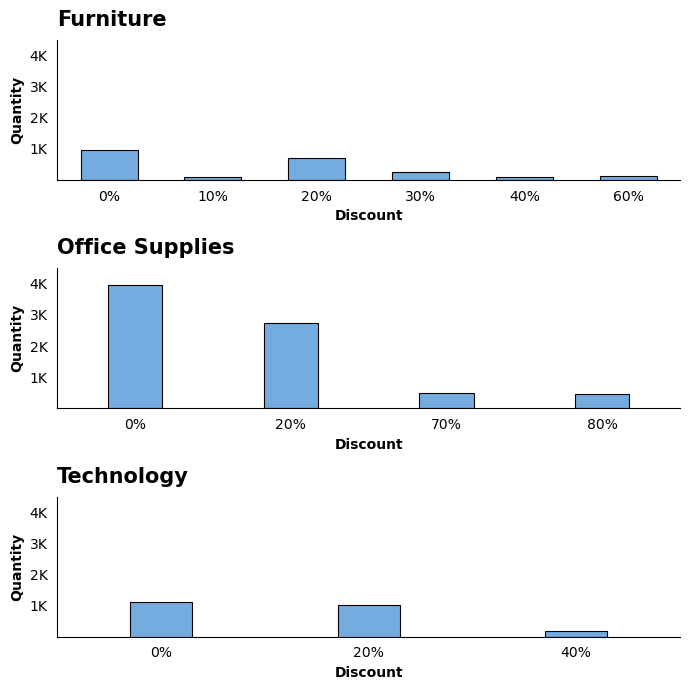
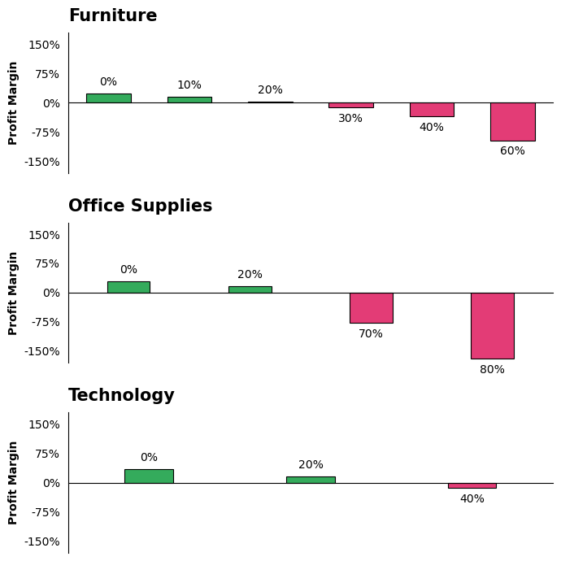
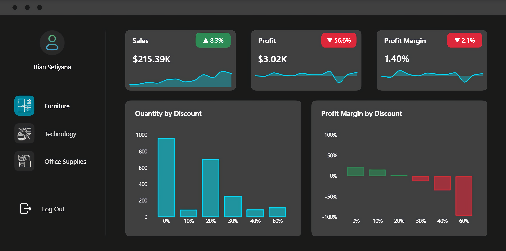

# Optimasi Strategi Diskon untuk Memaksimalkan Profitabilitas

# Ringkasan

Dalam industri retail, menjaga keseimbangan antara volume penjualan dan profitabilitas adalah tantangan besar. Proyek ini merupakan kelanjutan dari [proyek sebelumnya](https://github.com/RianSetiyana/Analisis-Peran-Diskon-pada-Bulan-dengan-Profit-Margin-Terendah) yang mengidentifikasi adanya penurunan profit akibat kebijakan diskon yang kurang tepat.

Dengan menggunakan data [Superstore](https://www.kaggle.com/datasets/vivek468/superstore-dataset-final), proyek ini berfokus untuk mencari solusi dengan menentukan batas maksimal (threshold) diskon yang paling optimal. Melalui serangkaian proses persiapan dan analisis data, diperoleh threshold diskon yang dapat memaksimalkan profitabilitas.

# Tujuan

1. Menentukan threshold diskon untuk setiap kategori.
2. Memberikan rekomendasi kebijakan diskon berbasis data.

# Rumusan Masalah

1. Bagaimana pengaruh diskon terhadap volume penjualan?
2. Pada tingkat diskon berapa profit margin mulai berubah menjadi negatif?

# Ruang Lingkup

Analisis difokuskan pada tahun 2017 sebagai representasi performa terbaru perusahaan.

# Tools yang Digunakan

## 1. PostgreSQL

Digunakan untuk menulis query dalam proses pengambilan, pembersihan, dan pemfilteran data.

## 2. Python

Digunakan sebagai alat utama dalam proses pengolahan dan analisis data. Library yang digunakan pada proyek ini antara lain:

- Pandas: Digunakan untuk manipulasi dan pengolahan data.
- Matplotlib: Digunakan sebagai dasar visualisasi data.
- Seaborn: Digunakan untuk membuat visualisasi yang lebih informatif.

## 3. Power BI

Digunakan untuk membangun dashboard yang merangkum hasil analisis.

# Persiapan Data

Pada tahap ini dilakukan standarisasi format tanggal, pembuatan fitur waktu, serta pemfilteran data pada tahun 2017 agar data siap untuk dianalisis lebih lanjut.

Detail proses persiapan data dapat dilihat pada file berikut: [Data_Preparation](SQL/Data_Preparation.sql)

### Memfilter Data

```sql
SELECT
    *
FROM
    cleaned_data
WHERE
    order_year = 2017;
```

# Proses Analisis

Setiap notebook pada proyek ini difokuskan untuk menjawab satu pertanyaan dari rumusan masalah. Berikut pendekatan analisis yang digunakan pada masing-masing notebook:

## 1. Hubungan Diskon terhadap Volume Penjualan

Proses diawali dengan mengelompokkan data berdasarkan kategori produk dan tingkat diskon untuk menghitung total transaksi dan jumlah produk terjual (quantity). Untuk menghindari bias informasi pada skala kecil, dilakukan pemfilteran data dengan hanya menyertakan tingkat diskon yang memiliki total transaksi di atas 20 pada setiap kategori. Langkah ini diambil guna memastikan bahwa grafik yang dihasilkan benar-benar merepresentasikan perilaku pasar.

Detail proses analisis dapat dilihat pada notebook berikut: [1_Sales_Volume_Analysis](Python/1_Sales_Volume_Analysis.ipynb)

### Visualisasi Data

```python
categories = df_agg.index.levels[0].tolist()
data = [df_agg.loc[category] for category in categories]

fig, ax = plt.subplots(nrows=3, ncols=1, figsize=(7,7))

title_dict = {'size':15,
              'weight':'bold',
              'color':'black',
              'loc':'left',
              'pad':10,
              'rotation':0,
              'family':plt.rcParams['font.family'],
              'alpha':1}

label_dict = {'x':
              {'size':10,
              'weight':'bold',
              'color':'black',
              'loc':'center',
              'rotation':0,
              'family':plt.rcParams['font.family'],
              'alpha':1},
              
              'y':
              {'size':10,
              'weight':'bold',
              'color':'black',
              'loc':'center',
              'rotation':90,
              'family':plt.rcParams['font.family'],
              'alpha':1}}

for i in range(len(ax)):
    df_plot = data[i]
    
    patch = sns.barplot(x=df_plot.index, y=df_plot['quantity'], ax=ax[i], color='#63adf2', ec='black', lw=0.8, alpha=1)
    
    if i == 0:
        for bar in patch.patches:
            bar.set_width(0.55)
            bar.set_xy((bar.get_xy()[0] + 0.125, 0))
    elif i == 1:
        for bar in patch.patches:
            bar.set_width(0.35)
            bar.set_xy((bar.get_xy()[0] + 0.225, 0))
    else:
        for bar in patch.patches:
            bar.set_width(0.3)
            bar.set_xy((bar.get_xy()[0] + 0.25, 0))
    
    ax[i].set_title(f'{categories[i]}', **title_dict)
    ax[i].set_xlabel('Discount', **label_dict['x'])
    ax[i].set_ylabel('Quantity', **label_dict['y'])
        
    ax[i].set_ylim(0, 4_500)
    ax[i].set_yticks(ticks=ax[i].get_yticks()[1:-1])
    ax[i].yaxis.set_major_formatter(plt.FuncFormatter(lambda y, pos: f'{y/1_000:.0f}K'))
    
    labels = [f'{discount}%' for discount in df_plot.index]
    ax[i].set_xticklabels(labels=labels)
    
    ax[i].tick_params(which='major', axis='both', colors='black', left=False, bottom=False)
        
    sns.despine(left=False, top=True, right=True, bottom=False, ax=ax[i])

plt.tight_layout()
plt.show()
```

### Hasil



## 2. Dampak Diskon terhadap Profit Margin

Proses diawali dengan mengelompokkan data berdasarkan kategori produk dan tingkat diskon untuk menghitung total transaksi, sales, dan profit. Profit margin kemudian dihitung sebagai persentase dari total profit terhadap sales pada masing-masing tingkat diskon. Untuk menghindari bias informasi pada skala kecil, dilakukan pemfilteran data dengan hanya menyertakan tingkat diskon yang memiliki total transaksi di atas 20 pada setiap kategori. Langkah ini diambil guna memastikan bahwa grafik yang dihasilkan benar-benar merepresentasikan perilaku pasar.

Detail proses analisis dapat dilihat pada notebook berikut: [2_Profit_Margin_Analysis](Python/2_Profit_Margin_Analysis.ipynb)

### Visualisasi Data

```python
categories = df_agg.index.levels[0].tolist()
data = [df_agg.loc[category] for category in categories]

fig, ax = plt.subplots(nrows=3, ncols=1, figsize=(7,7))

title_dict = {'size':15,
              'weight':'bold',
              'color':'black',
              'loc':'left',
              'pad':10,
              'rotation':0,
              'family':plt.rcParams['font.family'],
              'alpha':1}

label_dict = {'y':
              {'size':10,
              'weight':'bold',
              'color':'black',
              'loc':'center',
              'rotation':90,
              'family':plt.rcParams['font.family'],
              'alpha':1}}

for i in range(len(ax)):
    df_plot = data[i]
    palette = ['#ff206e' if margin < 0 else '#20bf55' for margin in df_plot['profit_margin']]
    
    patch = sns.barplot(x=df_plot.index, y=df_plot['profit_margin'], ax=ax[i], palette=palette, ec='black', lw=0.8, alpha=1)
    
    if i == 0:
        for bar in patch.patches:
            bar.set_width(0.55)
            bar.set_xy((bar.get_xy()[0] + 0.125, 0))
    elif i == 1:
        for bar in patch.patches:
            bar.set_width(0.35)
            bar.set_xy((bar.get_xy()[0] + 0.225, 0))
    else:
        for bar in patch.patches:
            bar.set_width(0.3)
            bar.set_xy((bar.get_xy()[0] + 0.25, 0))
    
    ax[i].set_title(f'{categories[i]}', **title_dict)
    ax[i].set_xlabel('')
    ax[i].set_ylabel('Profit Margin', **label_dict['y'])
    
    ax[i].spines['bottom'].set_position(('data', 0))
    ax[i].set_xticklabels('')
    ax[i].set_ylim(-180, 180)
    ax[i].set_yticks(ticks=list(range(-150, 151, 75)))
    ax[i].yaxis.set_major_formatter(plt.FuncFormatter(lambda y, pos: f'{y:.0f}%'))
    
    ax[i].tick_params(which='major', axis='both', colors='black', left=False, bottom=False)
    
    container = ax[i].containers[0]
    labels = [f'{discount}%' for discount in df_plot.index]
    ax[i].bar_label(container=container, labels=labels, size=10, weight='normal', color='black', padding=5)
    
    sns.despine(left=False, top=True, right=True, bottom=False, ax=ax[i])

plt.tight_layout()
plt.show()
```

### Hasil



# Insights

Berikut beberapa temuan utama yang diperoleh dari hasil analisis:

- **Pemberian diskon yang terlalu tinggi tidak efektif dalam meningkatkan volume penjualan**: Berdasarkan data kategori Furniture dan Technology, pemberian diskon hingga 20% adalah batas maksimal untuk mempertahankan volume penjualan yang stabil. Melebihi angka tersebut, jumlah produk terjual cenderung stagnan bahkan menurun signifikan. Fenomena ini paling terlihat pada kategori Office Supplies, di mana diskon ekstrem (70% - 80%) justru menghasilkan volume penjualan yang jauh lebih rendah dibandingkan saat tingkat diskon berada di angka 0% atau 20%.

- **Diskon di atas 20% menyebabkan kerugian**: Berdasarkan hasil analisis, angka 20% merupakan threshold pemberian diskon yang aman. Jika diskon ditingkatkan melebihi angka tersebut, profit margin pada seluruh kategori langsung berubah menjadi negatif. Kerugian paling ekstrem terlihat pada kategori Office Supplies, di mana pemberian diskon 70% dan 80% mengakibatkan penurunan margin hingga di bawah -75%.

# Dashboard Overview

Bagian ini menyajikan dashboard yang dibangun untuk memantau performa penjualan dan profitabilitas perusahaan secara menyeluruh. Fokus utamanya adalah memvisualisasikan hubungan antara kebijakan diskon dengan kuantitas produk terjual serta dampaknya terhadap profit margin. Hal ini dilakukan guna menentukan threshold diskon yang paling optimal untuk setiap kategori produk.

File dashboard dapat dilihat disini: [My_Dashboard](Power_BI/My_Dashboard.pbix)

### Tampilan Dashboard:



**Note**: Ikon yang digunakan dalam dashboard ini bersumber dari [Flaticon](https://www.flaticon.com/) dan [Freepik](https://www.freepik.com/).

# Kesimpulan

Berdasarkan hasil analisis, ditemukan bahwa 20% merupakan threshold diskon yang dapat diterapkan pada seluruh kategori produk. Pemberian diskon melebihi angka tersebut terbukti tidak efektif dalam meningkatkan volume penjualan dan justru menjadi penyebab kerugian. Berdasarkan temuan tersebut, berikut adalah rekomendasi strategi yang dapat diterapkan:

- **Membatasi diskon maksimal pada angka 20%**: Kebijakan ini perlu diterapkan untuk semua kategori produk guna menjaga agar profit margin tetap berada di zona positif.

- **Mengevaluasi diskon ekstrem pada kategori Office Supplies**: Pemberian diskon di tingkat 70% dan 80% harus segera dihentikan atau direvisi, karena terbukti memberikan dampak negatif yang signifikan terhadap profitabilitas.

- **Mengoptimalkan strategi harga dan pemasaran**: Perusahaan sebaiknya berfokus pada strategi nilai tambah atau promosi lain bagi produk yang tidak reaktif terhadap diskon, mengingat performa volume penjualan terbaik justru tercapai pada rentang diskon 0% hingga 20%.
